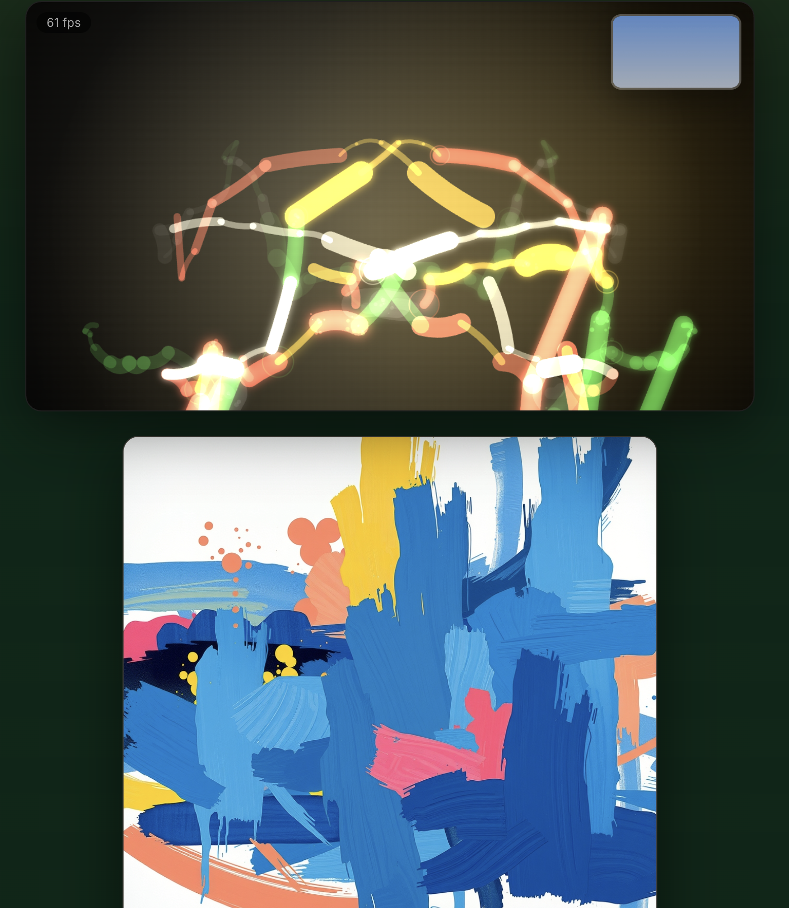
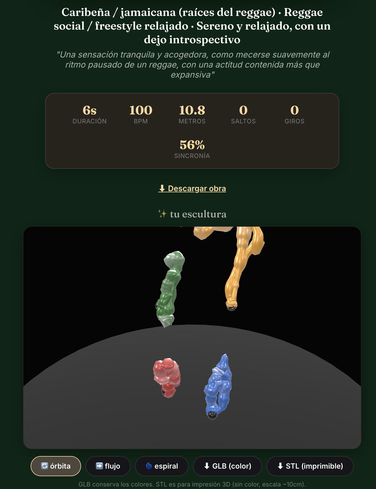
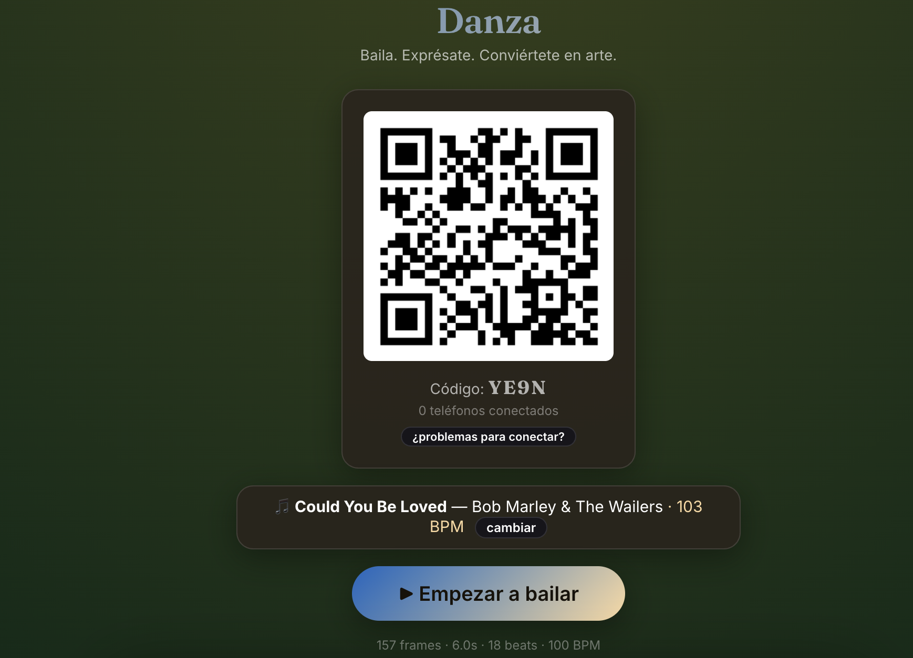

# Bailarte

**Baila. Exprésate. Conviértete en arte.**

Bailarte watches you dance — with your camera, your microphone, and Claude's vision — and turns the performance into a live generative painting, an AI-refined digital artwork, a 3D sculpture built from your motion trails, and a keepsake poster. Party guests can join from their phones to add a second camera angle, remote-control the session, or upload their own dance clip.

**The core idea:** the art comes from *you*, not the song. Culture, mood, color palette, and the "perceived experience" of the piece are all derived from your facial expression and movement quality — analyzed by Claude vision on the actual video. The song is rhythm backdrop only: it drives beat pulses and tempo, but it never decides what the art looks like.

## What it does

1. **Pick a song, play one out loud, or just start the mic** — three ways to bring rhythm into the room.
2. **Dance.** A generative painting builds itself live on screen in real time, reacting to your movement (fast/sharp gestures paint differently than slow/fluid ones) and pulsing on the beat.
3. **Around 7 seconds in**, Claude quietly looks at a frame of you dancing and starts re-theming the whole UI and palette live — the "it's watching you" moment.
4. **When you stop**, a full analysis pass runs, and you get a staged reveal: a digital painting (AI-generated via Cloudflare Workers AI when configured, otherwise a deterministic high-resolution re-render of your live painting), a rotating 3D sculpture built from your wrist/ankle/head trails (exportable as GLB or a 3D-printable STL), dance stats (duration, BPM, distance traveled, jumps, spins, beat-sync %), and a downloadable poster.
5. **Save it to the gallery**, and optionally scan the QR code from a phone to add a second camera angle, control the session remotely, or upload a separately recorded clip.

## Screenshots

| Live painting while dancing | Sculpture + stats reveal | Phone QR join |
|---|---|---|
|  |  |  |

## Quick start

```bash
git clone git@github.com:juanelopezm/Bailarte.git
cd Bailarte
npm install
npm run fetch-models   # downloads the MediaPipe pose model + wasm runtime (self-hosted, no CDN)
cp .env.example .env   # then fill in CLOUDFLARE_ACCOUNT_ID/CLOUDFLARE_API_TOKEN (optional — see below)
npm run dev
```

Open **`https://localhost:5173`** in Chrome and accept the self-signed certificate warning (needed for camera/microphone access). Grant camera and microphone permissions when prompted.

### Requirements

- **Node.js 25+** (uses native TypeScript execution — no build step, no `ts-node`, no `tsx`)
- **The `claude` CLI**, installed and logged in — this is what analyzes your dance. No separate API key needed; it uses your existing Claude Code session.
- **A Cloudflare account + API token** (optional, genuinely free — [dash.cloudflare.com](https://dash.cloudflare.com), no credit card required) — only needed for AI-generated painting images (via Workers AI's `flux-1-schnell` model, 10,000 free neurons/day). Without one, the app automatically uses a high-resolution deterministic re-render of your live painting instead, which is a fully legitimate piece of art in its own right (see [Known limitations](#known-limitations)).
- **Google Chrome** on the laptop — the live pose-tracking + painting pipeline is tuned for it. Phones can use Safari or Chrome.
- A **local WiFi network** if you want phones to join — no internet connection is required for the core experience at all.

## Joining from a phone

Once the app is running, a QR code appears on the main screen. Any phone on the **same WiFi** can scan it to join as:

- **📷 Cámara** — streams a second camera angle to the main screen over WebRTC (peer-to-peer, no video ever touches the server).
- **🎮 Control remoto** — start, stop, or "surprise me" the dance from your pocket.
- **📤 Subir video** — upload a separately recorded clip; it runs through the exact same analysis → painting → sculpture → poster pipeline as a live dance.

The phone's browser will show a certificate warning the first time — in Safari, "Show Details → visit this website"; in Chrome, "Advanced → Continue." This only happens once per phone per session.

## How it's built

```
Bailarte/
├── client/                Vite + React + TypeScript — the browser app
│   └── src/
│       ├── capture/        webcam, MediaPipe pose tracking, motion-feature extraction,
│       │                   keyframe capture, offline (uploaded-video) processing, dance stats
│       ├── audio/          song preview playback, mic input, live beat detection
│       ├── art/            the live generative painter + deterministic hi-res replay
│       ├── sculpture/      motion-trail → 3D geometry, GLB/STL export
│       ├── poster/         poster/gallery-card composition
│       ├── net/            API client, WebSocket client, WebRTC signaling
│       ├── phone/          phone-side screens (camera, remote, upload)
│       ├── battle/, ui/    stage screen, reveal flow, song picker, QR join, hall of fame
│       └── state/          app state (zustand)
├── server/                 Express + ws — the local hub
│   └── src/
│       ├── claude.ts        the vision-analysis pipeline (shells out to the `claude` CLI)
│       ├── cloudflareImage.ts Cloudflare Workers AI image-generation wrapper (isolated — this
│       │                     is the piece most likely to need updating as the API evolves)
│       ├── gallery.ts        JSON-file gallery persistence
│       ├── wsHub.ts          WebSocket session rooms + signaling relay
│       └── routes/           iTunes proxy, vision analysis, painting, gallery, upload, host-info
├── shared/                  Types and constants used by both client and server
│   ├── types.ts              MotionTape, VisionAnalysis, DanceStats, WebSocket message types
│   ├── playlist.ts            the "Surprise Me" curated multicultural song list
│   └── palettes.ts            fallback color palettes + contrast utilities
└── scripts/fetch-models.mjs  downloads the MediaPipe pose model at install time
```

**Everything runs on one machine.** The server binds only to `127.0.0.1:8787`; Vite's dev server proxies `/api` and `/ws` to it and is the only port exposed on the network (`https://<your-lan-ip>:5173`), so phones only ever need to trust one certificate and hit one origin.

### The analysis pipeline

- **Vision (Claude):** a few JPEG keyframes from the dance are sent to the local `claude` CLI with a structured-output schema. It looks at *the person* — expression, body language, movement quality — and returns culture, mood, a 5–6 color palette, and a description of what the dance felt like. This runs twice: once ~7 seconds into the dance for the live re-theme, and once authoritatively after you stop, driving the final palette and the painting prompt.
- **Motion (MediaPipe + custom feature extraction):** 33-point pose landmarks drive velocity, energy, smoothness, spatial reach, and symmetry — these are what actually paint the strokes, spawn the sculpture's trail thickness, and compute the dance stats. This is deliberately kept separate from the vision analysis so the *painting style* is driven by movement quality, not by which culture Claude thinks it's seeing.
- **Rhythm (Web Audio):** a live spectral-flux onset detector drives beat pulses in the live painting, for both "play a song" and "just use the mic" modes. It's rhythm only — it never influences color, mood, or culture.

## Known limitations

- **The painting API is text-only — no image input.** `flux-1-schnell` generates purely from the text prompt; it can't take the live-painted canvas as a visual reference the way an earlier Gemini-based version of this project attempted to. (That attempt was abandoned: Gemini's image models require a *billed* Google Cloud project even on a "free tier" API key — a personal Gemini/Google One subscription does not grant API quota, which is billed separately per-project through Google AI Studio.) Without `CLOUDFLARE_ACCOUNT_ID`/`CLOUDFLARE_API_TOKEN` set, the app falls back to a deterministic high-resolution re-render of the live painting as the "digital painting" — this is not a degraded placeholder, it's a legitimate generative artwork derived directly from your actual movement data.
- **WebRTC phone camera** needs a router that allows peer-to-peer connections on the local network. If it doesn't connect, "Subir video" (upload) is the reliable fallback and runs through the identical pipeline.
- **Art battle / voting and the persistent hall of fame** (head-to-head voting between dancers' artworks, judged live by party guests) are designed but not yet built.
- Tested primarily in Chrome; `requestVideoFrameCallback` (used for uploaded-video processing) isn't supported in Firefox.

## Disclaimer

This is an experimental party project, provided as-is with no warranty of any kind. A few things worth knowing:

- **Camera and microphone data**: video frames from the dancer's camera are sent to a third-party AI service (Cloudflare Workers AI) to generate the analysis and artwork. Uploaded videos go through the same pipeline. A phone joining as a second camera streams peer-to-peer directly to the host's screen and never touches the server. Frames/videos are not stored beyond what's needed to generate the art, unless you explicitly save a dance to the gallery.
- **The "culture," "dance style," and "mood" readings are AI-generated interpretive art, not factual or professional assessments** of any person's identity, culture, or background. They can be wrong, generic (see "Known limitations" above), or occasionally off-base — treat them as part of the art, not a claim about anyone.
- The app depends on several third-party services (Cloudflare, Pusher, Upstash, Vercel Blob, the iTunes Search API) that can change, rate-limit, or go down without notice.

## Attribution

Culture, mood, and artistic interpretation: **Claude** (via the `claude` CLI, using your own Claude Code session).
Digital painting generation: **Cloudflare Workers AI** (`@cf/black-forest-labs/flux-1-schnell`), when configured.
Pose tracking: **MediaPipe** (Google).
Song search and previews: the **iTunes Search API**.
